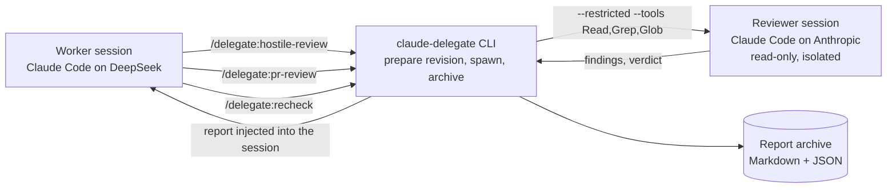

<div align="center">

# claude-delegate

**Delegate the code reviews of a Claude Code session running on DeepSeek to Claude — Opus by
default, Sonnet on demand — inside an isolated, read-only session, triggered deterministically by a
slash command.**

[](LICENSE)
[](https://claude.com/claude-code)
[](https://www.anthropic.com/claude)
[](https://www.deepseek.com)
[](https://www.python.org)
[](#contributing)

[Overview](#overview) · [Features](#features) · [Architecture](#architecture) · [Getting started](#getting-started) · [Usage](#usage) · [Isolation](#isolation-of-the-delegated-session) · [Contributing](#contributing)

</div>

<br>

## Overview

`claude-delegate` is a [Claude Code](https://claude.com/claude-code) plugin for developers who work in a
Claude Code session backed by a cheaper model (here, DeepSeek through the LINAGORA AI Gateway) but want
their code reviewed by a frontier model. The worker session stays on DeepSeek; the review itself runs in a
**separate, isolated, read-only Claude Code session** on Anthropic, using Opus by default.

The reviewer is never reached by accident: a slash command runs a deterministic CLI, which prepares the
revision to review, spawns the delegated session with a locked-down tool set and a rebuilt environment, and
archives a structured report. The DeepSeek session then verifies and triages each finding — nothing is
changed or published without your approval.

The plugin also carries the hand-off to a specification session: specs are not delegated, they are written
in an Anthropic-backed Claude Code session, and `/delegate:handoff` prepares a self-contained brief for it.

The v2 specification is tracked in issue #1.

## Features

### Review

- **Hostile review of your working changes.** `/delegate:hostile-review` reviews everything since the
  merge-base with a base branch — committed, staged and unstaged changes, plus untracked files that git does
  not ignore. The reviewed state is frozen in an unreferenced technical commit, without touching your index,
  and its identifier appears in the report.
- **Pull-request and merge-request review.** `/delegate:pr-review` reviews a GitHub pull request or a GitLab
  merge request **on its own code**, not on your local branch. The forge is inferred from `origin`, the head
  is fetched without moving any of your refs, and the review runs in a throwaway detached worktree created
  outside the repository.
- **Re-review after fixes.** `/delegate:recheck` has the reviewer rule on every Blocking or Important
  finding of a previous report — addressed, not addressed or poorly addressed — and also looks for
  regressions introduced by the fixes.
- **Project conventions, from a trusted revision.** The reviewer receives the root `CLAUDE.md` as it is at
  the merge-base (or the base branch, for a pull request), with its `@path` imports resolved in the same
  revision. A `CLAUDE.md` changed in the reviewed diff is read as code, never followed as an instruction.
- **Structured findings and a verdict.** Findings are ranked Blocking, Important and Minor. A pull-request
  review also returns an APPROVE or REQUEST_CHANGES verdict, justified in one sentence.

### Isolation

- **Read-only reviewer.** The delegated session runs with `--restricted --tools "Read,Grep,Glob"`: no shell,
  no web, no writes, and reads confined to the reviewed code.
- **Project configuration ignored.** Settings, hooks, permission rules, the project's `CLAUDE.md` and MCP
  servers are not loaded (`--strict-mcp-config`); only the trusted `CLAUDE.md` supplied by the CLI is given
  as guidance. Unauthorized requests are refused automatically (`--permission-mode dontAsk`).
- **A self-test proves it.** `/delegate:selftest` builds a trap project and asks the reviewer to escape it.
  See [Isolation](#isolation-of-the-delegated-session).

### Hand-off

- **Spec briefs.** `/delegate:handoff <topic>` writes a dated brief into
  `docs/specs/brief-YYYYMMDD-<topic>.md`, ready to feed an Anthropic-backed specification session.

### Launcher

- **`claude-deepseek`.** A small launcher that opens a Claude Code session on DeepSeek through the LINAGORA
  AI Gateway (`https://ai-api.linagora.com`, model `deepseek-v4.1-flash`), pointing every model — main,
  Opus, Sonnet, Haiku and sub-agents — at the gateway model, and raising the `!` command timeout to 15
  minutes.

## Architecture



The reviewer is a real Claude Code process, spawned by the CLI with a rebuilt environment and an explicit
model. Nothing about the worker session's configuration leaks into it.

### Stack

| Component | Role |
|---|---|
| [Claude Code](https://claude.com/claude-code) plugin | Slash commands, delegated reviewer session |
| Python 3.9+ (standard library) | `claude-delegate` CLI: revision preparation, spawning, report and archive |
| [git](https://git-scm.com) | Merge-base, frozen reviewed revision, throwaway worktrees |
| [GitHub CLI](https://cli.github.com) (`gh`) / [GitLab CLI](https://gitlab.com/gitlab-org/cli) (`glab`) | Reading a pull request or merge request on its forge |
| [LINAGORA AI Gateway](https://github.com/linagora/ai-gateway) | OpenAI-compatible endpoint serving DeepSeek to the worker session |

## Getting started

Requirements: Claude Code (preferably the native binary, `~/.local/bin/claude`), git, Python 3.9 or later, a
LINAGORA AI Gateway key for your worker sessions and a Claude subscription for the reviewer. To review pull
requests you also need the GitHub CLI (`gh`) or, for GitLab merge requests, the GitLab CLI (`glab`). On
Linux, the launcher reads the gateway key from the keychain with `secret-tool` (Debian/Ubuntu package
`libsecret-tools`).

Every step is done from a terminal.

1. **Add the marketplace and install the plugin.** The repository is private: you need git access to
   `linagora/claude-delegate`.

   ```bash
   claude plugin marketplace add linagora/claude-delegate
   claude plugin install delegate@claude-delegate
   ```

2. **Install the `claude-deepseek` launcher**, which opens Claude Code on DeepSeek through the LINAGORA AI
   Gateway (`https://ai-api.linagora.com`, model `deepseek-v4.1-flash`). The marketplace cloned the
   repository: a symlink is enough, and the launcher follows the marketplace updates:

   ```bash
   ln -s ~/.claude/plugins/marketplaces/claude-delegate/bin/claude-deepseek ~/.local/bin/claude-deepseek
   ```

   Then store your gateway key in the system keychain. The command prompts you for the key:

   ```bash
   # Linux (Debian/Ubuntu: sudo apt install libsecret-tools)
   secret-tool store --label="AI Gateway LINAGORA" service linagora-ai-api-key
   # macOS
   security add-generic-password -a "$USER" -s linagora-ai-api-key -w
   ```

   On a server with no keychain, export the key in `LINAGORA_API_KEY` instead.

   Then open your worker sessions with `claude-deepseek`. The launcher only sets its variables for the
   session it opens: your other sessions stay on Anthropic.
   - It points every model (main, Opus, Sonnet, Haiku and sub-agents) at the gateway model, because a gateway
     key reaches no other.
   - It raises the `!` command timeout to 15 minutes: an Opus review often exceeds the 2-minute default.
   - Claude Code does not know this model: the cost it displays is wrong, only the gateway billing counts.
   - The claude.ai connectors (Gmail, Google Drive, etc.) are not available in these sessions.
   - To go through DeepSeek's own API, set `CLAUDE_DEEPSEEK_BASE_URL`, `CLAUDE_DEEPSEEK_MODEL` and
     `CLAUDE_DEEPSEEK_KEY_SERVICE`, following the
     [DeepSeek documentation for Claude Code](https://api-docs.deepseek.com/quick_start/agent_integrations/claude_code).

3. **Sign in to Anthropic once**, in a dedicated, empty configuration directory. Do not create any link to
   `~/.claude` there: the delegated session must inherit neither your settings nor your plugins. This session
   is only for signing in: install nothing in it.

   ```bash
   mkdir -m 700 ~/.claude-anthropic
   CLAUDE_CONFIG_DIR=~/.claude-anthropic claude   # then /login, and quit
   ```

   On macOS, Claude Code stores these credentials in the keychain, under a key specific to that directory.
   On Linux, it stores them in the directory itself.

4. **Verify the isolation** of the reviewer, from a `claude-deepseek` session, after installation and after
   every Claude Code update:

   ```
   /delegate:selftest
   ```

   The self-test builds a trap project and asks the reviewer to escape it: read outside the repository and
   `.env`, write, run a shell. It also checks that the project's hook, MCP server and `CLAUDE.md` have no
   effect. It runs on Haiku and costs a few cents. Several guarantees rely on an undocumented behaviour of
   `--restricted`: if a check is not “OK”, do not use the delegation before you understand why.

## Usage

### Hostile review of your changes

```
/delegate:hostile-review [base] [--model sonnet]
```

The command reviews every change since the merge-base with the base: committed, staged and unstaged, plus
new untracked files, but not those git ignores. With no argument, the base is the default branch of
`origin`, or `main` as a fallback.

The reviewed state is frozen in an unreferenced technical commit, without touching your index. Its
identifier appears in the report, on the “Reviewed revision” line. The reviewer also reads the affected
files in your working tree: do not modify them during the review.

The review does not start, with exit code 3, when:

- the directory is not a git repository, or the repository has no commit yet;
- the base is not found, or has no common ancestor with `HEAD`;
- there is nothing to review;
- the diff exceeds 1,000,000 characters.

The reviewer knows the project's conventions. The CLI gives it the root `CLAUDE.md` as it is at the
merge-base, or its target if it is a symbolic link, with its `@path` imports read in the same revision. A
change to `CLAUDE.md` in the reviewed changes only appears in the diff: it is reviewed like the rest of the
code, never followed as an instruction.

Import rules:

- an import is only followed towards a file in the repository: never towards `~`, an absolute path, a
  directory or a forbidden file;
- an import that cannot be followed is replaced with the mention “import ignored”;
- imports inside a code block are not evaluated;
- conventions are capped at 20 imported files and 100,000 characters.

If git cannot read the conventions, the review stops with exit code 3.

The reviewer is Opus by default. `--model sonnet` replaces it with Sonnet, and no other model is accepted.

The report header states how the review ran:

- the model actually used and the effort;
- the turns, the estimated cost and the duration;
- the hash of the prompt that was sent;
- the plugin and Claude Code versions;
- the permissions refused to the reviewer.

### Review a pull request or merge request

```
/delegate:pr-review <number> [--forge github|gitlab] [--model sonnet]
```

The command reviews a GitHub pull request or GitLab merge request on its own code, not on your local branch.

The forge is inferred from the host of `origin`:

- `github.com` means GitHub;
- a host whose name contains “gitlab”, such as gitlab.com, or one `glab` is signed in to, such as a
  self-hosted instance, means GitLab;
- in other cases, for example GitHub Enterprise, state the forge with `--forge github` or `--forge gitlab`.

The forge's tool must be signed in: `gh auth login` or `glab auth login`. `glab` is required only for
GitLab.

- `gh` or `glab` provides the title, the description, the target branch, the head and the URL of the pull
  request.
- git fetches the target branch and the head of the pull request (`pull/<number>/head`, or
  `merge-requests/<number>/head` on GitLab) without moving any ref in your repository. Your branch, index
  and working tree do not change either.
- The reviewer reads the pull request in a throwaway detached worktree, created outside the repository
  without running any git hook. The CLI first removes every `CLAUDE.md`, `CLAUDE.local.md`, `.claude/` and
  `.mcp.json` from it, whatever their case: configuration brought by the pull request never reaches the
  reviewer. The worktree is removed at the end, even on failure or interruption.
- The reviewer receives the title, the description and the diff since the merge-base with the target branch.
  Its conventions are those of the target branch, never those of the pull request: a change to `CLAUDE.md`
  is reviewed as code.
- `.env*` and `.claude/settings*.json` files stay out of the review, since they may contain secrets. Those
  the pull request changes are named in the report header, on the “Files not reviewed” line: review them
  yourself.
- The report gives a verdict, APPROVE or REQUEST_CHANGES, justified in one sentence. Its header states the
  number and URL of the pull request, its target branch and the reviewed head.

DeepSeek then verifies each finding at the reviewed head, with `git show <head>:<path>`, without checkout.
Nothing is published to the forge: you decide what you publish.

If the pull request changes, even by a force-push, simply run the command again.

The review does not start, with exit code 3, when:

- the forge of `origin` is not recognised: state it with `--forge`;
- `gh` or `glab` is missing, or cannot read the pull request;
- the pull request changed during preparation: then run the command again;
- the pull request has no common ancestor with its target branch, changes only files excluded from the
  review or nothing at all, or its diff exceeds 1,000,000 characters.

### Re-review after fixes

```
/delegate:recheck [report]
```

After your fixes, the command has the reviewer rule on every Blocking or Important finding of the original
report: addressed, not addressed or poorly addressed, with a justification. It also re-reads everything
that changed since the revision reviewed by that report, to spot regressions introduced by the fixes.

- With no argument, the re-review targets the repository's latest report. Otherwise, name a report by its
  identifier, or by the path of its Markdown or JSON file.
- A re-review can itself be re-reviewed: the next one rules on what it left open — the findings not
  addressed or poorly addressed, with their latest status — and on its new blocking or important findings.
  You can thus chain fixes and re-reviews.
- The reviewer receives the findings to rule on, the delta since the revision reviewed by the original
  report and the current full diff. The current state is frozen as for a hostile review, untracked files
  included. The delta is limited to the files your work touches, before or after the fixes: what a rebase or
  a merge brings from the base is not included. The reviewer runs with the model of the original review.
- The report recalls each ruled-on finding and its status, then gives the new findings, numbered after all
  the previous ones. Its header links it to the original report.
- DeepSeek summarises the statuses and lists what is still blocking.

For a pull request or merge request, the re-review re-requests the pull request from its forge, fetches its
new head and has it reviewed in a new throwaway worktree, cleaned as for the review, with the conventions of
the target branch. The delta goes from the head reviewed by the original report to the new one. This works
even after a force-push, as long as the old head is still present in your repository. As for the review,
DeepSeek verifies each finding with `git show <head>:<path>`, without checkout, and nothing is published to
the forge.

The re-review does not start, with exit code 3, when:

- the report is not found, unreadable, or concerns another repository;
- nothing has changed since the original report;
- git has purged the revision reviewed by the original report, for example the old head of a pull request
  after a force-push: then launch a full review;
- the delta and the full diff together exceed 1,000,000 characters;
- for a pull request, the same cases as for its review: forge, tool or head not found.

### Exit codes

| Code | Meaning |
|---|---|
| 0 | Review succeeded, report archived |
| 2 | Invalid arguments |
| 3 | Preparation impossible: the reviewer was not called |
| 4 | Claude quota exhausted, with the resume date when known |
| 5 | Incomplete review: budget cap or maximum number of turns reached |
| 6 | Structured output from the reviewer missing or non-conforming |
| 7 | Another failure of the delegated session, or report that cannot be archived |
| 8 | Self-test failed: the reviewer's isolation is no longer guaranteed |

On failure, nothing is archived and the message goes to stderr. Claude Code then cancels the command and
displays that message.

The report (Blocking, Important and Minor findings) is archived in
`${XDG_STATE_HOME:-~/.local/state}/claude-delegate/<repository>/`, together with a JSON file. It is then
injected into the session. DeepSeek verifies and triages each finding without changing anything before your
approval.

From a terminal: `<plugin directory>/bin/claude-delegate hostile-review [base]`, `pr-review <number>` or
`recheck [report]`.

### Prepare a specification

```
/delegate:handoff <topic>
```

Specifications are not delegated: they are written in an Anthropic-backed Claude Code session, with
`grill-me` then `to-spec`. This command has DeepSeek write a dated brief into
`docs/specs/brief-YYYYMMDD-<topic>.md`. It contains the context, the goal, the decisions already made, the
constraints, the open questions, and the useful files and references. The Anthropic session then only has to
start from that brief.

## Isolation of the delegated session

- **Read-only**: `--restricted --tools "Read,Grep,Glob"`. No shell, no web, no writes, and reads confined to
  the reviewed code: the repository, or the pull request's worktree.
- **Configuration ignored**: the project's settings, hooks, permission rules and `CLAUDE.md` are not loaded
  by Claude Code, nor are MCP servers (`--strict-mcp-config`). Only the trusted version of `CLAUDE.md`,
  supplied by the CLI, is given to the reviewer as guidance. On an unauthorized request, the refusal is
  automatic (`--permission-mode dontAsk`).
- **Forbidden files**: `**/.env`, `**/.env.*` and `**/.claude/settings*.json`. The reviewer cannot read
  them, and they are excluded from the diff it receives.
- **Environment rebuilt from scratch**: only `HOME`, `USER`, `LOGNAME`, `PATH`, `LANG`, `LC_*`, `TERM` and
  `TMPDIR` pass through, plus `CLAUDE_CONFIG_DIR=~/.claude-anthropic`. No `ANTHROPIC_*` or `CLAUDE_CODE_*`
  variable and no token.
- **Bounded cost**: effort `high`, at most 30 turns, and a cap of $5 estimated. This cap is soft: Claude
  Code checks it after each call, so it can be exceeded by one call.

Useful variables:

- `CLAUDE_DELEGATE_BIN`: the `claude` binary to use. Otherwise, the CLI takes `~/.local/bin/claude`, then
  the first `claude` in `PATH` that is not a cmux shim.
- `XDG_STATE_HOME`: root of the report archive.

## Tests

```bash
python3 -m unittest discover -s tests -t .
claude plugin validate --strict . && claude plugin validate --strict plugins/delegate
```

The tests call the CLI as a process, in real temporary git repositories, with a fake `claude` and a fake
`gh` or `glab`. A pull request lives there in a local bare repository serving as `origin`, to which a
`url.insteadOf` rule gives a GitHub or GitLab URL. The `claude-deepseek` launcher is tested the same way,
with fake `claude`, `security`, `secret-tool` and `uname`. The tests make no network call and no model call.

## Repository layout

| Path | Content |
|---|---|
| [`bin/claude-deepseek`](bin/claude-deepseek) | Launcher that opens Claude Code on DeepSeek through the LINAGORA AI Gateway |
| [`plugins/delegate/`](plugins/delegate) | The plugin: slash commands, prompts, and the `claude-delegate` CLI (`claude_delegate/`) |
| [`tests/`](tests) | End-to-end tests of the CLI and the launcher, against temporary git repositories |
| [`docs/`](docs) | Agent-facing documentation: issue tracker, triage labels, domain docs |
| [`.claude-plugin/marketplace.json`](.claude-plugin/marketplace.json) | Marketplace manifest |

## Roadmap

- Human acceptance run of a real DeepSeek session on macOS and a Linux workstation ([#12](https://github.com/linagora/claude-delegate/issues/12)).
- v2 specification and its follow-ups: [issue #1](https://github.com/linagora/claude-delegate/issues/1).

## Contributing

Contributions are welcome: see [CONTRIBUTING.md](CONTRIBUTING.md), and the
[Code of Conduct](CODE_OF_CONDUCT.md) that governs participation. The code base uses French for its domain
vocabulary, comments, commit messages and most documentation; this README and the community files are in
English.

## Security

Please do not report security vulnerabilities through public issues. See [SECURITY.md](SECURITY.md) to
report them privately.

## License

Copyright © 2026 [LINAGORA](https://linagora.com).

claude-delegate is free software, released under the
[GNU Affero General Public License v3.0](LICENSE).
